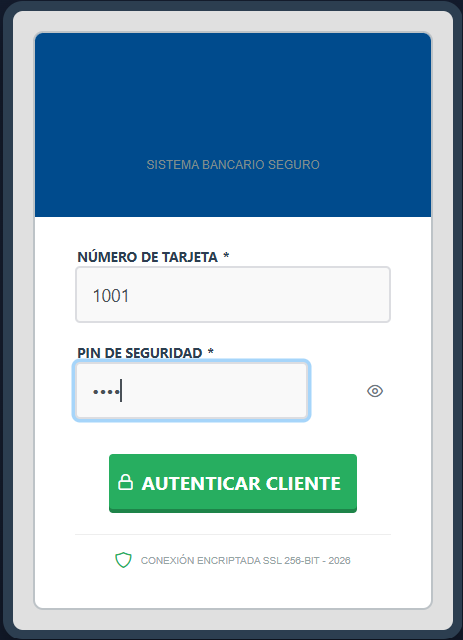
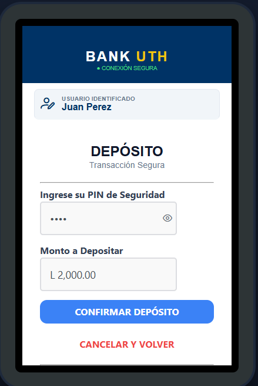
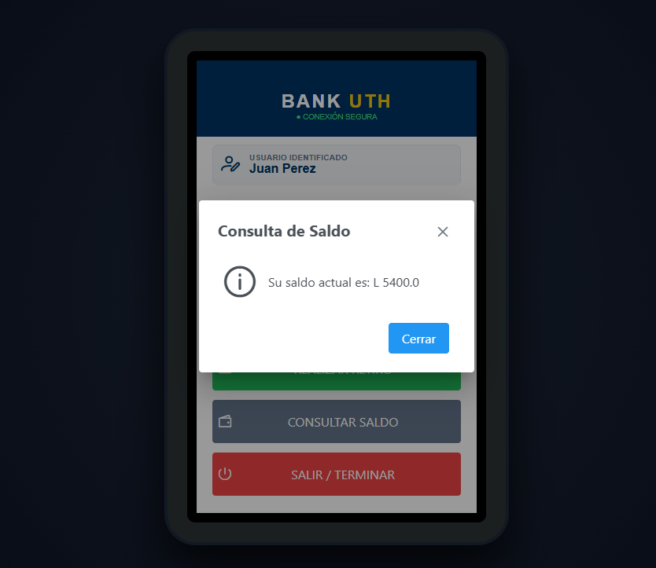

# cajero-automatico_grupo-3

🏦 Bank UTH - Cajero Automático (Grupo #3)
¡Hola! Este es nuestro proyecto de simulación de un Cajero Automático, desarrollado para la clase. Quisimos crear un sistema que no solo funcione, sino que se sienta real, eficiente y, sobre todo, seguro.

¿Cómo hacerlo funcionar? (Instrucciones de ejecución)
Para que el proyecto corra en tu computadora, solo sigue estos pasos rápidos:

Importar el proyecto: Abre tu IDE favorito (nosotros usamos Eclipse/IntelliJ) e importa la carpeta como un proyecto Maven existente.

Librerías: Haz clic derecho sobre el proyecto y selecciona Maven -> Update Project (o dale a Install) para que se descarguen las dependencias de PrimeFaces.

Servidor: Asegúrate de tener configurado un servidor como GlassFish o Payara.

¡A correr!: Dale "Run" al servidor y abre en tu navegador la dirección:
http://localhost:9091/cajero-automatico.jsf/index.xhtml

**Paso 1: Inicio de Sesión**
Entra con tu número de tarjeta y PIN. Agregamos un indicador de encriptación SSL de 256-bit para realismo profesional.

**Paso 2: Menú de Operaciones**
El panel es intuitivo y permite las siguientes transacciones:

* **Realizar Depósito:** Ingresas el monto y confirmas.

* **Realizar Retiro:** Defines la cantidad a retirar con validación de PIN.

* **Consultar Saldo:** Usamos una ventana modal para ver el saldo rápido.

Paso 3: Seguridad Extra Para los retiros y depósitos, el sistema te pedirá confirmar con tu PIN. Lo hicimos así para simular un doble factor de seguridad.

